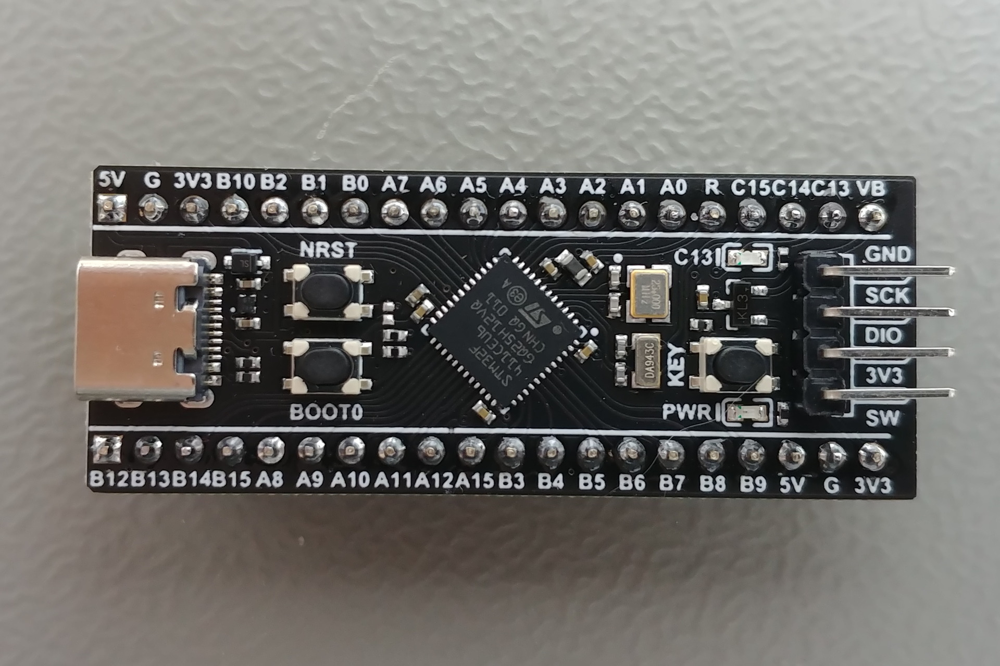
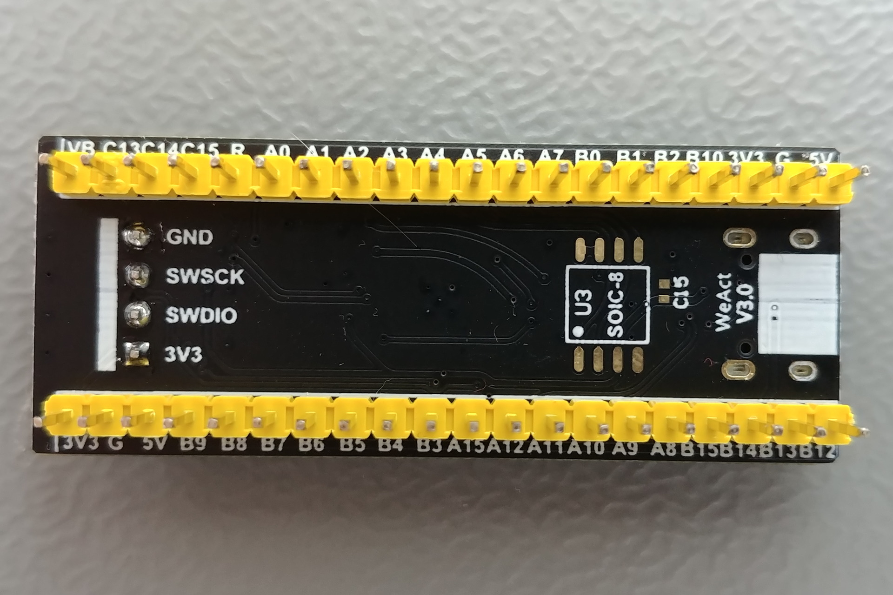

# BLACK-PILL 

* MCU  STM32F411CEU6
    * mémoire FLASH 512Ko
    * mémoire RAM 128ko 
    * Fclk maximal  100Mhz 

 

La carte que j'ai en main a les composants C15 (100nF) et U3 (25Q128JVSQ, mémoire flash SPI de 16Mo) installés.

## Pinout

