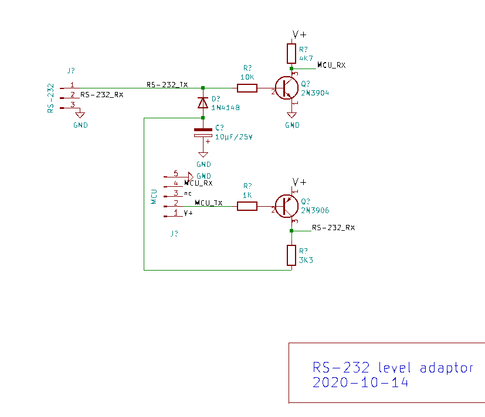
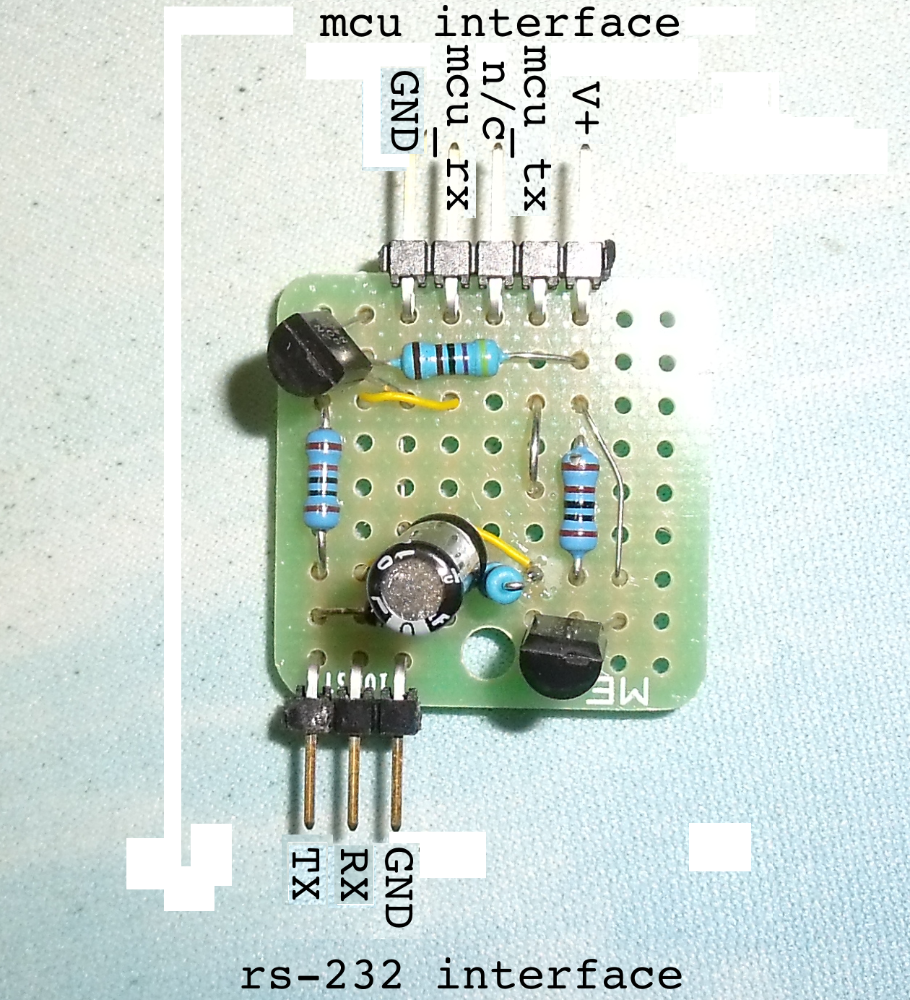
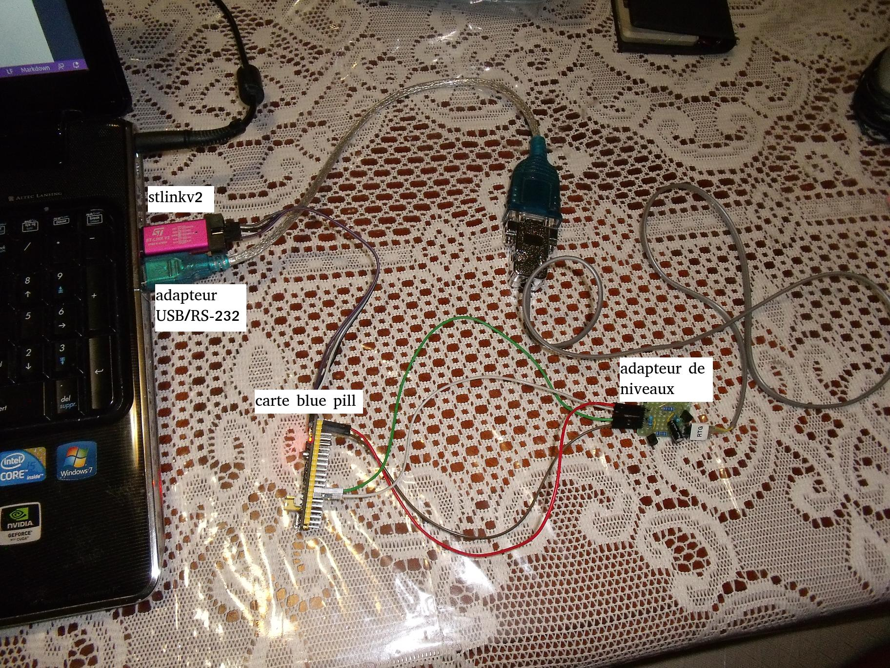

# stm32-eforth

Adaptation de eforth pour sur les cartes **blue-pill** et **black-pill. Je vais travaillé à partir du fichier original de C.H. Ting [stm32eForth720](http://forth.org/OffeteStore/2165_stm32eForth720.zip).  Le code source a été écris en assembleur pour les outils de développements µVision 5. Je vais utilisé **gcc-arm-none-eabi** il faudra donc une réécriture du fichier source original. 

Pour le suivit de mises à jours consultez le fichier [journal.md](journal.md)


## prérequis

Je travaille sur Ubuntu 20.04 LTS les logiciles suivants doivent-être installés. 

    sudo apt install gcc-arm-none-eabi
    sudo apt install stlink-tools
  
Une description détaillée de l'installation des outils de développement est disponible [ici](https://picatout-jd.blogspot.com/2018/08/pilule-bleue-introduction.html). 
```
Found 1 stlink programmers
 serial:     483f6e066772574857351967
 hla-serial: "\x48\x3f\x6e\x06\x67\x72\x57\x48\x57\x35\x19\x67"
 flash:      65536 (pagesize: 1024)
 sram:       20480
 chipid:     0x0410
 descr:      F1xx Medium-density
jacques@hp15:~/github/stm32-eforth$ 
```
## communication

La comminication avec la carte se fait par le USART1 configuré à 115200 BAUD, pas de parité, 8 bits et 1 stop. Pas de contrôle de flux.

Pour l'adaptation des niveaux de voltage entre le port RS-232 du PC et la carte **blue-pill** j'ai fabriqué le petit adapteur de niveau que voici.





Côté carte **blue pill** les connection sont les suivantes:

 * **V+** broche **3.3v**.
 * **GND** broche **G**.
 * **TX** broche **A9**
 * **RX** broche **A10**

Côté RS-232

* **TX** broche 2 du connecteur DB-9 femelle.
* **RX** broche 3 du connecteur DB-9 femelle.
* **GND** broche 5 du connecteur DB-9 femelle.




## organisation des fichiers

Dans le dossier **board** il y a un dossier pour chaque carte. Pour garder ça le plus simple possible. Chaque dossier à tout ce qu'il faut pour construire et flasher **eforth**. Il y a un **readme.md** dans chaque dossier. 

## structure des dossiers 

* stm32-eforth
    * board
        * blue-pill
            * build 
            * docs 
        * black-pill
            * build 
            * docs 
        * stm32g431-nucleo-32 
            * build 
            * docs 
    * docs 


## carte blue pill


## carte black pill 


## carte NUCLEO-G431KB

Pour cette carte je suis bloqué car **st-flash** ne fonctionne pas avec la version 3 du programmeur STLINK utilisé sur cette carte. 


